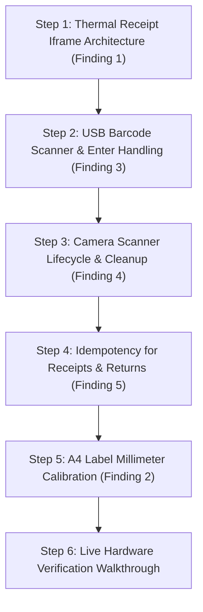

# SPH Billing — Phase 4D: Hardware & Real-World UAT Inspection Report

**System**: Sri Parvathi Hardwares (SPH) Billing & POS System  
**Report Type**: Phase 4D Hardware & Real-World UAT Inspection Report  
**Date**: March 2026  
**Status**: Pre-Implementation Audit Complete — Awaiting Approval  
**File Location**: `docs/PHASE_4D_INSPECTION_REPORT.md`  

---

## 1. Phase 4D Scope

Phase 4D validates real-world retail hardware compatibility, peripheral integration, network resilience, and cashier workflows for Sri Parvathi Hardwares in Kallakurichi, Tamil Nadu.

### Scope Boundaries:
- **Phase 1–4C Preservation**: Zero modifications to financial math, return accounting equations, RBAC roles, database migration baseline, or backup encryption mechanisms.
- **Production Region**: Neon PostgreSQL in AWS São Paulo (`sa-east-1`) remains active and untouched; `DATABASE_URL` is unchanged.
- **Inspection First**: No code fixes or behavioral alterations are applied during this phase without explicit user approval.
- **Hardware Coverage**:
  1. Thermal Receipt Printers (2-inch 58mm / 3-inch 80mm / 4-inch 100mm continuous roll).
  2. A4 Laser/Inkjet Printers (Full-page invoices and multi-grid die-cut sticker label sheets).
  3. USB Handheld Barcode Scanners (1D/2D HID keyboard-wedge mode).
  4. Camera Barcode Scanners (`html5-qrcode` video stream lifecycle).
  5. Network Latency & Cross-Continental Timeout Handling (Idempotency Key expansion).
  6. In-Place Session Expiry Re-Authentication (State and cart preservation).
  7. Two-Counter POS Terminal Concurrency (Row lock sequences and contention).
  8. End-to-End Real-World Retail Cashier Workflows (10 core retail scenarios).

---

## 2. Categorized Inspection Findings

### Finding 1: Thermal Receipt Printing Page Reload & Sizing
- **Classification**: **CRITICAL**
- **Current Behavior**:
  Clicking "Save & Print" in the active billing screen invokes `window.print()` directly on the main application page. Exactly 1000ms later, `window.location.reload()` executes in a `setTimeout` callback.
- **Evidence**:
  - File: [`frontend-react/src/pages/CreateSalesInvoice.jsx`](file:///f:/MY%20Works/SPH%20Software/frontend-react/src/pages/CreateSalesInvoice.jsx#L565-L578)
  - File: [`frontend-react/src/pages/CreateSalesReturn.jsx`](file:///f:/MY%20Works/SPH%20Software/frontend-react/src/pages/CreateSalesReturn.jsx#L508-L515)
  ```javascript
  if (action === 'print') {
      window.print();
  }
  showToast("Sales Invoice saved successfully!", "success");
  setTimeout(() => {
      navigate('/sales#salesList', { replace: true, state: {} });
      window.location.reload();
  }, 1000);
  ```
- **Risk**:
  - `window.print()` prints the entire active web page (including search bar, navigation tabs, action buttons, and cart table) instead of a formatted thermal receipt slip.
  - While the cashier is viewing the browser print dialog or selecting a printer, the underlying page reloads 1 second later, terminating the print job, causing browser dialog crashes, and returning the cashier to an empty list view.
  - Conversely, [`frontend-react/src/pages/ViewSalesInvoice.jsx`](file:///f:/MY%20Works/SPH%20Software/frontend-react/src/pages/ViewSalesInvoice.jsx#L254-L275) uses an isolated hidden iframe with clean thermal styling, but the cashier billing screen does not use it.
- **Recommended Fix**:
  1. Refactor `CreateSalesInvoice.jsx` and `CreateSalesReturn.jsx` to adopt the hidden iframe pattern: `<iframe ref={iframeRef} style={{ display: 'none' }} />`.
  2. Populate the iframe with formatted thermal receipt HTML (`@page { margin: 2mm; size: 80mm auto; }`) for 58mm, 80mm, or 100mm rolls.
  3. Remove `window.location.reload()`; handle navigation cleanly via React Router state transitions.
- **Physical Hardware Testing Required**: **Yes** (Requires physical 58mm / 80mm ESC/POS thermal receipt printer).

---

### Finding 2: A4 Label Printing Screen Pixel (`px`) Scaling Drift
- **Classification**: **HIGH**
- **Current Behavior**:
  A4 barcode tag sheets compute grid dimensions, row heights, column gaps, and margins using screen pixels converted via an arbitrary scalar (`* 3.78px`). Tag printing in `CreateItem.jsx` opens an unmanaged popup tab (`window.open('', '_blank')`).
- **Evidence**:
  - File: [`frontend-react/src/pages/PrintTags.jsx`](file:///f:/MY%20Works/SPH%20Software/frontend-react/src/pages/PrintTags.jsx#L153-L168)
  - File: [`frontend-react/src/pages/CreateItem.jsx`](file:///f:/MY%20Works/SPH%20Software/frontend-react/src/pages/CreateItem.jsx#L523-L527)
  ```javascript
  width: `${210 * 3.78}px`,
  height: `${297 * 3.78}px`,
  gridTemplateColumns: `repeat(${cols}, ${settings.tsWidth * 3.78}px)`,
  columnGap: `${(settings.tsA4HSpace ?? 2) * 3.78}px`,
  rowGap: `${(settings.tsA4VSpace ?? 2) * 3.78}px`,
  padding: `${(settings.tsA4MarginTop ?? 12) * 3.78}px ...`
  ```
- **Risk**:
  - CSS screen pixels (`px`) do not map consistently across physical printer resolutions (DPI) and Windows display scaling (125%, 150%). Sub-pixel rounding errors accumulate across 10 rows, causing lower rows (rows 7 to 10) to drift vertically by 2mm–5mm and miss pre-cut label boundaries.
  - Standard browser margins (unless manually set to "None" in Chrome) compress the page and eject an unwanted blank second page.
  - `window.open` is frequently blocked by modern browser popup blockers.
- **Recommended Fix**:
  1. Migrate `@media print` rules from calculated pixels to native physical millimeters (`mm`):
     ```css
     @media print {
         @page { size: A4 portrait; margin: 0mm; }
         .a4-page { width: 210mm; height: 297mm; box-sizing: border-box; }
     }
     ```
  2. Replace `window.open` in `CreateItem.jsx` with the hidden iframe print execution pattern.
- **Physical Hardware Testing Required**: **Yes** (Requires physical laser printer with standard 24-up / 40-up A4 sticker sheets).

---

### Finding 3: USB Keyboard-Wedge Barcode Scanner Input Handling
- **Classification**: **HIGH**
- **Current Behavior**:
  The item search field in billing is a standard uncontrolled text input without an `Enter` key listener or global keyboard wedge listener.
- **Evidence**:
  - File: [`frontend-react/src/pages/CreateSalesInvoice.jsx`](file:///f:/MY%20Works/SPH%20Software/frontend-react/src/pages/CreateSalesInvoice.jsx#L650-L666)
  - File: [`frontend-react/src/pages/CreatePurchaseInvoice.jsx`](file:///f:/MY%20Works/SPH%20Software/frontend-react/src/pages/CreatePurchaseInvoice.jsx#L660-L675)
- **Risk**:
  - Handheld USB barcode scanners act as virtual keyboards, inputting rapid character bursts terminated by an `Enter` keystroke.
  - If the search box is focused, scanning an item enters the code and fires `Enter`. Because no `onKeyDown` handler intercepts `Enter`, the item is **not added to the cart**. The cashier is forced to manually click the item card with the mouse.
  - If the cashier's focus is currently inside a table cell (such as a quantity field), scanning an item types the barcode string directly into the quantity box (e.g. turning quantity `1` into `18901234567890`).
- **Recommended Fix**:
  1. Add an `onKeyDown` handler to the search input: on `Enter`, if the query matches an item code or barcode, call `addItemByCode(code)`, play a positive audio tone, and clear the input.
  2. Implement a global keypress buffer listener that detects rapid sequential keystrokes (< 40ms inter-character latency) ending in `Enter`, automatically routing scanned codes to cart addition regardless of which non-input element currently has focus.
- **Physical Hardware Testing Required**: **Yes** (Requires physical USB handheld scanner).

---

### Finding 4: Camera Scanner (`html5-qrcode`) Stream Lifecycle & Unmount Leaks
- **Classification**: **HIGH**
- **Current Behavior**:
  Camera scanning starts asynchronously via a timer, but lacks component unmount cleanup hooks.
- **Evidence**:
  - File: [`frontend-react/src/pages/CreateSalesInvoice.jsx`](file:///f:/MY%20Works/SPH%20Software/frontend-react/src/pages/CreateSalesInvoice.jsx#L228-L273)
  - File: [`frontend-react/src/pages/CreatePurchaseInvoice.jsx`](file:///f:/MY%20Works/SPH%20Software/frontend-react/src/pages/CreatePurchaseInvoice.jsx#L230-L275)
  - File: [`frontend-react/src/pages/CreateSalesReturn.jsx`](file:///f:/MY%20Works/SPH%20Software/frontend-react/src/pages/CreateSalesReturn.jsx#L220-L265)
  - File: [`frontend-react/src/pages/Items.jsx`](file:///f:/MY%20Works/SPH%20Software/frontend-react/src/pages/Items.jsx#L250-L290)
- **Risk**:
  - If a user opens the camera scanner and navigates away or presses the browser Back button while the camera is active, the camera hardware track (`MediaStreamTrack`) is never stopped. The camera indicator LED remains illuminated and locks device resources.
  - Re-opening the scanner often throws `Camera already in use` or fails silently.
  - If the modal is closed within 300ms of opening, the DOM node `#billing-qr-reader` is removed before `Html5Qrcode` initializes, causing unhandled JavaScript errors.
- **Recommended Fix**:
  1. Attach an explicit `useEffect` unmount cleanup handler:
     ```javascript
     useEffect(() => {
         return () => {
             if (html5QrCodeRef.current && html5QrCodeRef.current.isScanning) {
                 html5QrCodeRef.current.stop().then(() => html5QrCodeRef.current.clear()).catch(() => {});
             }
         };
     }, []);
     ```
  2. Validate DOM node presence before invoking `.start()`.
- **Physical Hardware Testing Required**: **Yes** (Requires tablet, mobile device, or laptop camera).

---

### Finding 5: Idempotency Protection Scope Gap
- **Classification**: **HIGH**
- **Current Behavior**:
  The database-backed idempotency engine (`handleIdempotencyBegin` / `handleIdempotencyCommit`) is active on `POST /api/sales/create` and `POST /api/purchases/create`, but is **absent** from customer receipts, sales returns, purchase returns, and vendor payments.
- **Evidence**:
  - File: [`backend/server.js`](file:///f:/MY%20Works/SPH%20Software/backend/server.js#L295-L380)
  - Absence in `POST /api/receipts/create` (line 3451)
  - Absence in `POST /api/sales-returns/create` (line 2811)
  - Absence in `POST /api/purchase-returns/create` (line 3150)
  - Absence in `POST /api/vendor-payments/create` (line 3780)
- **Risk**:
  - In cross-continental deployment (India to São Paulo), if a customer payment of ₹15,000 times out after database commit, the frontend receives a network error.
  - If the cashier clicks "Save" again, the un-idempotent retry either fails with a balance error or creates a duplicate receipt allocation.
- **Recommended Fix**:
  1. Add `handleIdempotencyBegin` and `handleIdempotencyCommit` wrappers to `receipts/create`, `sales-returns/create`, `purchase-returns/create`, and `vendor-payments/create`.
  2. Ensure frontend payment and return forms generate and retain an `Idempotency-Key` across retries.
- **Physical Hardware Testing Required**: **No** (Can be verified via simulated network latency and concurrent retry test suites).

---

### Finding 6: Session Expiry In-Place Re-Authentication
- **Classification**: **PASS**
- **Current Behavior**:
  When a session expires during invoice entry, HTTP 401 is intercepted non-destructively by `window.fetch`. A singleton modal (`SessionExpiredModal.jsx`) prompts for login. Upon successful re-authentication, the mutation retries once with the **same `Idempotency-Key`**.
- **Evidence**:
  - File: [`frontend-react/src/main.jsx`](file:///f:/MY%20Works/SPH%20Software/frontend-react/src/main.jsx#L30-L55)
  - File: [`frontend-react/src/utils/sessionCoordinator.js`](file:///f:/MY%20Works/SPH%20Software/frontend-react/src/utils/sessionCoordinator.js)
  - Verified by Phase 4B Test 17: Multi-item sales invoice re-authenticated and succeeded with 0 lost items and 0 duplicate stock deductions.
- **Risk**: Low.
- **Recommended Enhancement**: Verify identical error-boundary behavior on purchase invoices and customer receipt forms.
- **Physical Hardware Testing Required**: **No**.

---

### Finding 7: Two-Counter POS Concurrency & Lock Sequencing
- **Classification**: **MEDIUM**
- **Current Behavior**:
  The Phase 4A lock hierarchy is maintained:
  - Sequence: `document_sequences` $\rightarrow$ `items` $\rightarrow$ `customers`/`vendors` $\rightarrow$ `sales_invoices`/`purchase_invoices`.
  - In `/api/sales-returns/create`, the original invoice is locked first (`WHERE id = $1 FOR UPDATE`), followed by `items` (`ORDER BY code ASC FOR UPDATE`), followed by `customers`.
- **Evidence**:
  - File: [`backend/server.js`](file:///f:/MY%20Works/SPH%20Software/backend/server.js#L2841-L2944)
  - In `/api/sales/create`: Locks `items` first, then `customers`, then inserts a new invoice.
- **Risk**:
  - Because `/api/sales/create` only inserts *new* invoice rows, it does not contest locks on existing invoices.
  - However, if Counter 1 creates a return against Invoice A while Counter 2 cancels Invoice A, both transactions compete for Invoice A, Item locks, and Customer locks. The deterministic order (`sales_invoices` then `items` then `customers`) prevents deadlocks in these scenarios.
- **Recommended Fix**:
  Add `SET LOCAL statement_timeout = '5000'` to mutation transactions to guarantee fail-fast release if an unexpected cross-terminal lock contention occurs.
- **Physical Hardware Testing Required**: **No**.

---

### Finding 8: End-to-End Real-World Retail Cashier Workflows
- **Classification**: **PASS / OPERATIONAL**

| # | Retail Cashier Workflow | Components Traversed | Status / Findings |
| :-: | :--- | :--- | :--- |
| **1** | **Cash Sale → Print Thermal Receipt** | `CreateSalesInvoice` $\rightarrow$ `/api/sales/create` $\rightarrow$ Print | ⚠️ **Blocked by Finding 1** (Backend math passes; UI print reloads page). |
| **2** | **Credit Sale → Customer Pending** | `CreateSalesInvoice` $\rightarrow$ `customers.pending_to_receive` | **PASS** ✅ Verified by Phase 4A Test 3. |
| **3** | **Partial Payment → Allocation** | `CreateAmountReceived` $\rightarrow$ `/api/receipts/create` | **PASS** ✅ Pending balance reduced; needs Idempotency-Key. |
| **4** | **Full Payment → Pending Cleared** | `/api/receipts/create` $\rightarrow$ Zero balance reached | **PASS** ✅ Exact balance cleared. |
| **5** | **Sales Return → Return Accounting** | `CreateSalesReturn` $\rightarrow$ `/api/sales-returns/create` | **PASS** ✅ Stock restored, balance reduced; print flow affected by Finding 1. |
| **6** | **Purchase Invoice → Vendor Payable** | `CreatePurchaseInvoice` $\rightarrow$ `vendors.pending_to_pay` | **PASS** ✅ Inventory incremented; payable balance recorded. |
| **7** | **Cash Purchase → Vendor Payment** | `CreatePayment` $\rightarrow$ `/api/vendor-payments/create` | **PASS** ✅ Payable balance reduced. |
| **8** | **Purchase Return → Vendor Credit** | `CreatePurchaseReturn` $\rightarrow$ `purchase_returns` | **PASS** ✅ Stock deducted; debit note created. |
| **9** | **Barcode Scan → Cart → Save** | USB / Camera Scanner $\rightarrow$ `addItemByCode` $\rightarrow$ Save | ⚠️ **Friction in Finding 3** (Enter key does not auto-add without mouse click). |
| **10** | **Session Expiry During Active Bill** | 401 Interceptor $\rightarrow$ `SessionExpiredModal` $\rightarrow$ Retry | **PASS** ✅ Cart state preserved; retry successful. |

---

## 3. Critical Blockers for Physical Store Trials

1. **Thermal Receipt Page Reload Loop (Finding 1)**:
   Cashiers cannot complete a sale with "Save & Print" because the page reloads 1 second after opening the print dialog, causing disorientation and risking double submissions.
2. **USB Scanner `Enter` Key Stalling (Finding 3)**:
   Cashiers scanning products with handheld scanners must manually reach for the mouse to click each product card after every scan, nullifying barcode scanning speed benefits.
3. **Receipt & Payment Idempotency Gap (Finding 5)**:
   Unstable network connections between Kallakurichi and São Paulo could trigger double receipts or allocation errors during payment processing.

---

## 4. Required Hardware Tests

| Target Hardware | Model / Interface | Test Scenario | Success Criteria |
| :--- | :--- | :--- | :--- |
| **Thermal Receipt Printer** | 3-inch (80mm) USB/LAN Thermal (e.g. Epson TM-T82, TVS RP-3200) | Print 10-item retail sales invoice via hidden iframe | Paper cuts cleanly; company header, GST tax breakup, and grand total align within 72mm printable width. |
| **A4 Label Printer** | Standard Laser (HP LaserJet / Canon LBP) with 24-up / 40-up sticker sheet | Print 24 barcode tags from `PrintTags.jsx` | Row 1 and Row 10 barcodes fit within die-cut sticker borders with zero vertical drift. |
| **USB Handheld Scanner** | 1D/2D Laser/CCD Scanner (USB HID Keyboard Wedge) | Scan 5 items consecutively into billing screen without mouse interaction | Each scan instantly adds item, increments quantity on duplicate scan, and maintains focus for next item. |
| **Mobile / Tablet Camera** | Android / iPadOS Chrome with back camera | Open camera modal, scan QR code, close modal, re-open 5 times | Stream starts in < 1s; closing modal completely extinguishes camera indicator LED. |
| **Cash Drawer Kick (RJ11)** | Standard RJ11 24V connected via receipt printer | Cash sale completed | Printer sends ESC/POS pulse (`\x1B\x70\x00\x19\xFA`) to pop cash drawer. |

---

## 5. Required Browser & Printer Driver Configuration Tests

1. **Chrome Print Settings Test**:
   - Margin setting: "None" vs "Default" vs "Minimum".
   - Scale setting: Exact 100% (disable "Fit to Printable Area" to avoid label distortion).
   - Headers and Footers: Disabled (prevents URL/date stamping on thermal receipts).
2. **Thermal Printer Paper Sizing**:
   - Verify printer driver page format matches paper width: `80mm x 297mm` or `80mm x Continuous`.
3. **Popup Blocker Compatibility**:
   - Verify all print commands run via hidden `<iframe>` so Chrome / Edge never suppresses the print prompt.

---

## 6. Recommended Implementation Order (Pending Approval)



1. **Step 1: Thermal Receipt Iframe Architecture (Finding 1)**
   - Port the proven hidden iframe printing mechanism from `ViewSalesInvoice.jsx` into `CreateSalesInvoice.jsx` and `CreateSalesReturn.jsx`.
   - Remove `window.location.reload()`.
2. **Step 2: USB Barcode Scanner & Enter Key Handling (Finding 3)**
   - Add `onKeyDown` Enter handler to the billing search input to auto-add items and clear search query.
   - Add global keypress listener for rapid-fire scanner wedge input.
3. **Step 3: Camera Scanner Lifecycle & Cleanup (Finding 4)**
   - Add unmount `useEffect` hooks and modal dismissal guards for `Html5Qrcode` streams.
4. **Step 4: Expand Idempotency Protection to Receipts & Returns (Finding 5)**
   - Wrap `/api/receipts/create`, `/api/sales-returns/create`, and `/api/vendor-payments/create` with `handleIdempotencyBegin` and `handleIdempotencyCommit`.
5. **Step 5: A4 Label Millimeter Calibration (Finding 2)**
   - Replace calculated screen pixels (`* 3.78px`) in `PrintTags.jsx` with native physical `mm` CSS print rules.
6. **Step 6: Real-World Hardware Verification Walkthrough**
   - Execute the 10 retail cashier workflows on physical test hardware and generate the Phase 4D completion walkthrough.

---

## 7. Approval Checkpoint

> [!IMPORTANT]
> **No code changes have been made during this inspection phase.**  
> All 126 existing automated regression tests remain passing.
> 
> Awaiting user review and approval before beginning Step 1 of implementation.
