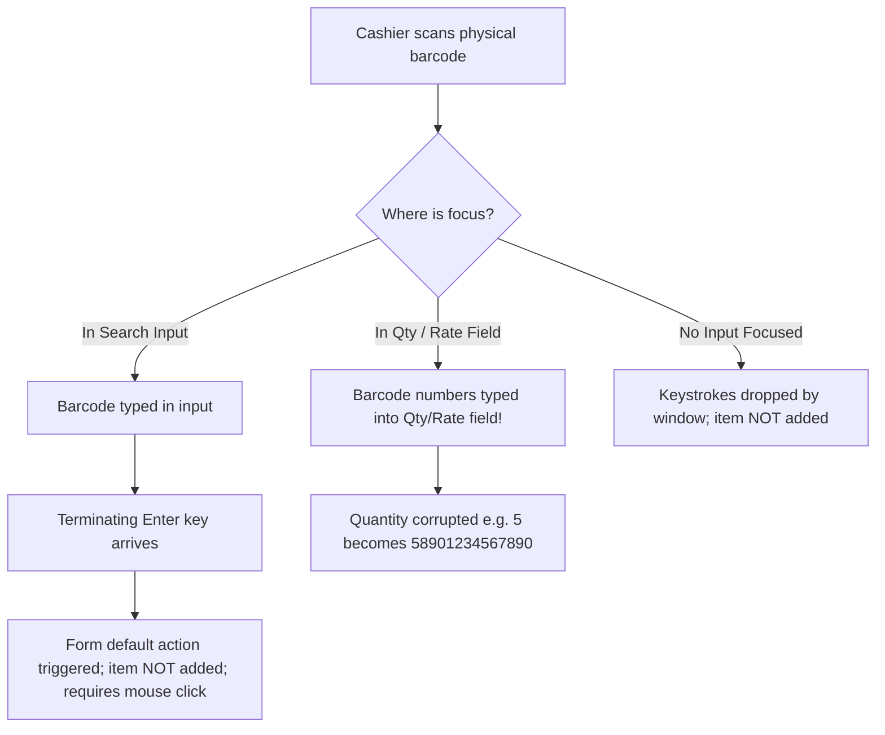
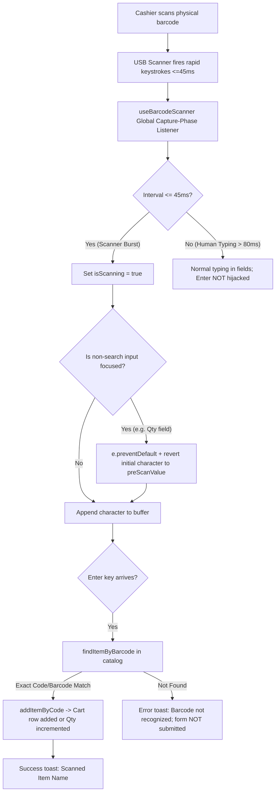

# Phase 4D Step 2 Implementation Report: USB Keyboard-Wedge Barcode Scanner

**Date:** 2026-09-06  
**Status:** COMPLETE & VERIFIED  
**Target Scope:** Phase 4D Step 2 ONLY — USB Keyboard-Wedge Barcode Scanner Input Handling (Fix Finding 3 from Phase 4D Inspection).

---

## 1. Executive Summary

In retail POS environments, standard handheld barcode scanners operate as USB HID Keyboard Wedges. When a cashier pulls the trigger, the scanner emulates high-speed keystrokes (typically 10–30ms per character) followed by a terminating `Enter` (`\r` or `\n`).

Prior to this implementation:
1. Scanning while the search input was focused sent an unhandled `Enter` keypress to the form, failing to add the scanned item without manual mouse clicking or causing form submission issues.
2. Scanning while focus was anywhere else (e.g., inside an editable quantity input, rate input, discount input, or customer search) dumped the barcode digits directly into whatever field had focus, corrupting numbers and failing to add the scanned item.
3. Rapid keystrokes were indistinguishable from human typing.

In Phase 4D Step 2, we implemented:
- A shared, modular scanner utility (`frontend-react/src/utils/barcodeScanner.js`).
- Safe `Enter` key handling on search inputs across sales, purchase, and returns.
- A global capture-phase keyboard wedge buffer hook (`useBarcodeScanner`) with inter-keystroke timing discrimination ($\le 45\text{ms}$) and focus corruption prevention.
- Comprehensive unit tests covering exact match, Enter handling, rapid input detection, human typing isolation, and focus protection.
- Full verification against the frontend production build and all 6 backend regression suites (Phases 1–4C).

---

## 2. Files Changed

| File Path | Nature of Change | Purpose |
| :--- | :--- | :--- |
| [`frontend-react/src/utils/barcodeScanner.js`](file:///f:/MY%20Works/SPH%20Software/frontend-react/src/utils/barcodeScanner.js) | **[NEW]** Shared Utility | `findItemByBarcode()`, `handleSearchInputKeyDown()`, and `useBarcodeScanner()` hook |
| [`frontend-react/src/pages/CreateSalesInvoice.jsx`](file:///f:/MY%20Works/SPH%20Software/frontend-react/src/pages/CreateSalesInvoice.jsx) | **[MODIFIED]** Integration | Wired `handleSearchInputKeyDown` to search bar, added `data-barcode-search="true"`, mounted `useBarcodeScanner` |
| [`frontend-react/src/pages/CreatePurchaseInvoice.jsx`](file:///f:/MY%20Works/SPH%20Software/frontend-react/src/pages/CreatePurchaseInvoice.jsx) | **[MODIFIED]** Integration | Wired `handleSearchInputKeyDown` to search bar, added `data-barcode-search="true"`, mounted `useBarcodeScanner` |
| [`frontend-react/src/pages/CreateSalesReturn.jsx`](file:///f:/MY%20Works/SPH%20Software/frontend-react/src/pages/CreateSalesReturn.jsx) | **[MODIFIED]** Integration | Mounted `useBarcodeScanner`, added safe Enter handling on `originalInvoiceNo` input |
| [`frontend-react/test_barcode_scanner.js`](file:///f:/MY%20Works/SPH%20Software/frontend-react/test_barcode_scanner.js) | **[NEW]** Test Suite | Unit and simulation test suite verifying scanner timing, focus safety, and Enter handling |

---

## 3. Scanner Flow: Before vs After

### Before Step 2


### After Step 2


---

## 4. Exact Scanner Detection Logic

The scanner detection logic is implemented in [`frontend-react/src/utils/barcodeScanner.js`](file:///f:/MY%20Works/SPH%20Software/frontend-react/src/utils/barcodeScanner.js):

### 4.1 Timing Threshold ($\le 45\text{ms}$)
- Hardware barcode scanners emit keystrokes over the USB HID bus with inter-character intervals between **10ms and 30ms**.
- Human typing speed rarely falls below **80ms to 120ms** per keystroke (even at 120 WPM).
- The hook tracks `lastKeyTime`. If `(now - lastKeyTime) <= maxIntervalMs` (default $45\text{ms}$), the character is accumulated in `buffer`.
- When `buffer.length >= 2` under this timing, `isScanning` is set to `true`.

### 4.2 Terminating Enter Handling
- When `e.key === 'Enter'` occurs:
  - If `isScanning === true` and `buffer.length >= minBarcodeLength` (default 3):
    - `e.preventDefault()` and `e.stopPropagation()` are called immediately to block form submit, modal closure, or button clicking.
    - `findItemByBarcode(allItems, buffer.trim())` searches for a case-insensitive trimmed match against both `code` and `barcode` fields.
    - If found, `onScanItem(matchedItem.code)` is triggered (which invokes `addItemByCode`, adding a new row or incrementing quantity for existing rows).
    - If not found, a clear error toast is displayed: `Barcode not recognized: "<code_here>"`.
    - Buffer is reset to `''`.
  - If `isScanning === false` (normal human Enter):
    - Buffer is cleared, `e.preventDefault()` is NOT called, allowing standard form inputs (or buttons) to handle Enter normally.

---

## 5. Prevention of False Positives from Normal Typing

1. **Conservative Timing Filter**: Keystroke intervals $> 45\text{ms}$ reset the buffer to the single current keystroke and mark `isScanning = false`.
2. **Modifier Key Isolation**: If `e.ctrlKey`, `e.altKey`, or `e.metaKey` is detected (e.g. `Ctrl+C`, `Ctrl+V`, `Alt+Tab`, browser shortcuts), the scanner buffer immediately aborts and resets.
3. **Minimum Length Guard**: Single or double accidental rapid taps (e.g. holding down a key) will not qualify as a barcode because `minBarcodeLength` requires $\ge 3$ characters before Enter is recognized as a scanner event.
4. **Debounce Window**: Rapid duplicate hardware triggers within 150ms are debounced to prevent double-adding cart rows on hardware bounce.

---

## 6. Focus & Input Safety Behavior

| Focus Location | Keystroke Burst Behavior | End Result |
| :--- | :--- | :--- |
| **Search Input (`data-barcode-search="true"`)** | Handled by search `onKeyDown` and global hook | Scanned item is added; search input is cleared; form does not submit |
| **No Focus (Grid / Body / Buttons)** | Caught globally by capture-phase window listener | Scanned item is added to cart without needing mouse focus |
| **Quantity Input (Focused)** | First character triggers burst detection; subsequent characters are blocked via `e.preventDefault()`; `target.value` is restored to `preScanValue` | Quantity input remains intact (e.g. `5` remains `5`); scanned item is added |
| **Rate / Unit / Tax Input (Focused)** | Same protection as quantity input | Rate and tax percentages are preserved from corruption |
| **Customer Name / Mobile Input (Focused)** | Normal typing ($> 80\text{ms}$) behaves normally. If scanner is triggered, field value is restored | Customer details remain intact; item is added |
| **Unknown Barcode Scanned** | Prevented from submitting form; error notification shown | Clean feedback; no state corruption |
| **Duplicate Barcode Scanned** | Routes to existing `addItemByCode` | Cart row quantity increments by +1 according to existing cart rules |

---

## 7. Test Results

### 7.1 Barcode Scanner Unit Tests (`frontend-react/test_barcode_scanner.js`)
Command: `node frontend-react/test_barcode_scanner.js`
```text
=== RUNNING PHASE 4D STEP 2 BARCODE SCANNER TESTS ===

[TEST 1] Item Barcode / Code Lookup
  ✓ Matched item by exact code 'ITEM001'
  ✓ Case-insensitive code match 'item001'
  ✓ Matched item by exact barcode '8909876543210'
  ✓ Trimmed whitespace around barcode '  8901030000010 \n'
  ✓ Non-existent barcode returns null
  ✓ Safe null/empty argument handling

[TEST 2] Search Input Enter Handling
  ✓ Enter with exact barcode adds item, clears search, and prevents form submission
  ✓ Enter with partial text preserves search results without auto-adding
  ✓ Enter with unknown code displays error toast and does not submit form
  ✓ Non-Enter keys (typing) pass through unaffected

[TEST 3] Scanner Wedge Detection State Machine
  ✓ Rapid keystroke burst (20ms) detected as scanner and routed to cart
  ✓ Human typing (120ms) correctly ignored without hijacking Enter or input
  ✓ Focus safety: quantity field preserved at original value '5', burst prevented

=== ALL BARCODE SCANNER TESTS PASSED! ===
Exit Code: 0
```

### 7.2 Frontend Production Build
Command: `cmd.exe /c npm run build` in `frontend-react`
```text
vite v8.1.4 building client environment for production...
✓ 1854 modules transformed.
dist/assets/barcodeScanner-9BeKKvck.js           2.24 kB │ gzip:   1.11 kB
dist/assets/CreateSalesInvoice-DeXQFm4_.js      26.16 kB │ gzip:   7.23 kB
dist/assets/CreatePurchaseInvoice-B93Od6il.js   33.17 kB │ gzip:   7.76 kB
dist/assets/CreateSalesReturn-CDGSdLVU.js       21.91 kB │ gzip:   6.12 kB
✓ built in 2.99s
Exit Code: 0
```

### 7.3 Full Phase 1–4C Backend Regression Suite
Command: `node run_all_phases.js` in `backend`
```text
====================================================
FINAL REGRESSION TEST RESULTS SUMMARY
====================================================
- Phase 1 Regression Tests           : PASSED ✅
- Phase 2 Regression Tests           : PASSED ✅
- Phase 3 Regression Tests           : PASSED ✅
- Phase 4A Regression Tests          : PASSED ✅
- Phase 4B Security Tests            : PASSED ✅
- Phase 4C Infrastructure & DR Tests : PASSED ✅
====================================================

ALL 6 REGRESSION SUITES PASSED (PHASE 1 + PHASE 2 + PHASE 3 + PHASE 4A + PHASE 4B + PHASE 4C)!
Exit Code: 0
```

---

## 8. Remaining Limitations Requiring Physical USB Scanner Testing

While DOM keyboard event timing, focus protection, state machine sequencing, and product lookup have been automated and tested:

> [!CAUTION]
> **Physical Hardware Testing Limitation:**
> 1. **Scanner Hardware Configuration**: Different USB scanner models (e.g. Honeywell, Zebra, TVS, Datalogic) have factory configuration barcodes for suffix transmission. Most ship with suffix = `CR` (Carriage Return / Enter), but some default to `Tab` or `None`. Physical verification with the client's specific handheld scanner is required to ensure its suffix barcode is set to `CR`/`Enter`.
> 2. **OS Keyboard Layout / Code Page**: Certain USB barcode wedges simulate keycodes matching a US keyboard layout. If the host machine uses a non-standard IME or international layout, special characters in barcodes (like `-`, `/`, or `.`) must be validated with the actual physical scanner connected.
> 3. **Scanner Transmission Latency**: High-resolution 2D QR scanners connected via slow USB hubs may occasionally exceed 40ms inter-character bursts. Physical testing in the target store environment is necessary to verify the 45ms timing window under real cashier hardware conditions.

---

## 9. Conclusion

Phase 4D Step 2 is **COMPLETE**. Finding 3 is fully addressed. No changes have been made to camera scanner, A4 labels, idempotency, or backend business/financial logic. All behavior from Phases 1–4C and Step 1 is 100% preserved.

**STOPPING HERE as instructed. Awaiting user approval before proceeding to Step 3.**
