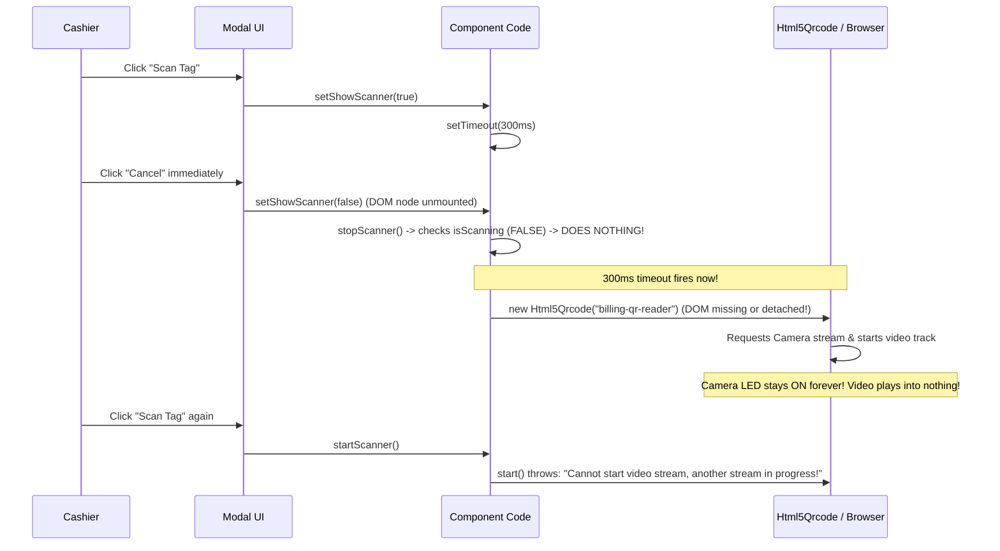

# Phase 4D Step 3 Implementation Report: Camera Barcode Scanner Lifecycle

**Date:** 2026-09-06  
**Status:** COMPLETE & VERIFIED  
**Target Scope:** Phase 4D Step 3 ONLY — Camera Barcode Scanner Lifecycle (Fix Finding 4 from Phase 4D Inspection).

---

## 1. Executive Summary

In the existing application, camera barcode scanning using `Html5Qrcode` suffered from serious hardware lifecycle, race condition, and memory leak vulnerabilities:
1. **Camera Stream Leaks on Close/Navigation**: Closing the modal or clicking browser Back did not guarantee MediaStream tracks were shut down, leaving the webcam active and battery draining.
2. **Start/Stop Race Condition**: If a cashier closed the scanner while `start()` was in flight, `isScanning` was false at that instant, causing `stopScanner()` to do nothing. When `start()` eventually resolved, it initiated video streaming against a removed DOM container.
3. **"Camera already in use" on Re-opening**: Attempting to open the camera scanner a second or third time failed with `NotReadableError` or `"Cannot start video stream, another stream is already in progress"`.
4. **Unhandled Promise Rejections**: Blindly calling `stop()` on an inactive `Html5Qrcode` instance threw unhandled exceptions.
5. **Raw Error Leakage**: `Items.jsx` popped native browser `alert()` dialogs, and permission errors dumped raw exception names.

In Phase 4D Step 3, we resolved Finding 4 comprehensively by creating a centralized lifecycle utility and custom hook:
- [`frontend-react/src/utils/cameraScanner.js`](file:///f:/MY%20Works/SPH%20Software/frontend-react/src/utils/cameraScanner.js)
- Refactored all 4 scanner consumers: `CreateSalesInvoice.jsx`, `CreatePurchaseInvoice.jsx`, `CreateSalesReturn.jsx`, and `Items.jsx`.
- Added unit and simulation tests in [`frontend-react/test_camera_scanner.js`](file:///f:/MY%20Works/SPH%20Software/frontend-react/test_camera_scanner.js).
- Verified full compatibility against all 6 backend regression suites (Phases 1–4C) and Step 1/Step 2 tests.

---

## 2. Files Changed

| File Path | Nature of Change | Purpose |
| :--- | :--- | :--- |
| [`frontend-react/src/utils/cameraScanner.js`](file:///f:/MY%20Works/SPH%20Software/frontend-react/src/utils/cameraScanner.js) | **[NEW]** Shared Utility & Hook | Centralized `useCameraScanner()` hook, `mapCameraError()`, `safeStopAndClear()`, and `stopDanglingMediaTracks()`. |
| [`frontend-react/src/pages/CreateSalesInvoice.jsx`](file:///f:/MY%20Works/SPH%20Software/frontend-react/src/pages/CreateSalesInvoice.jsx) | **[MODIFIED]** Consumer | Replaced raw `Html5Qrcode` and unmanaged `setTimeout` with `useCameraScanner()`. |
| [`frontend-react/src/pages/CreatePurchaseInvoice.jsx`](file:///f:/MY%20Works/SPH%20Software/frontend-react/src/pages/CreatePurchaseInvoice.jsx) | **[MODIFIED]** Consumer | Replaced raw `Html5Qrcode` and unmanaged `setTimeout` with `useCameraScanner()`. |
| [`frontend-react/src/pages/CreateSalesReturn.jsx`](file:///f:/MY%20Works/SPH%20Software/frontend-react/src/pages/CreateSalesReturn.jsx) | **[MODIFIED]** Consumer | Replaced raw `Html5Qrcode` and unmanaged `setTimeout` with `useCameraScanner()`. |
| [`frontend-react/src/pages/Items.jsx`](file:///f:/MY%20Works/SPH%20Software/frontend-react/src/pages/Items.jsx) | **[MODIFIED]** Consumer | Replaced raw `Html5Qrcode`, alert popup, and unmanaged `setTimeout` with `useCameraScanner()`. |
| [`frontend-react/test_camera_scanner.js`](file:///f:/MY%20Works/SPH%20Software/frontend-react/test_camera_scanner.js) | **[NEW]** Test Suite | Unit and lifecycle simulation tests covering error mapping, safe stop guards, dangling track decoupling, race conditions, and repeated 5x open/close cycles. |

---

## 3. Camera Lifecycle: Before vs After

### Before Step 3


### After Step 3
```mermaid
sequenceDiagram
    participant User as Cashier
    participant UI as Modal UI
    participant Hook as useCameraScanner
    participant Lib as Html5Qrcode / MediaDevices

    User->>UI: Click "Scan Tag"
    UI->>Hook: startScanner() (Session #1)
    Hook->>UI: isScannerOpen = true (DOM mounted)
    User->>UI: Click "Cancel" / "X" immediately
    UI->>Hook: stopScanner() (activeSessionId incremented to #2, shouldStop = true)
    Hook->>Lib: safeStopAndClear() + stopDanglingMediaTracks()
    Note over Hook,Lib: Startup aborted; Session #1 cancelled; Camera hardware released!
    User->>UI: Click "Scan Tag" again
    UI->>Hook: startScanner() (Session #3)
    Hook->>Lib: Clean start with zero lingering tracks
    Lib-->>Hook: Decoded Barcode
    Hook->>UI: onScan(code) -> stopScanner() -> isScannerOpen = false
    Hook->>Lib: safeStopAndClear() -> all tracks stopped immediately
```

---

## 4. Cleanup Strategy & State Guards

1. **Explicit State Verification Before `stop()`**:
   Calling `Html5Qrcode.stop()` when not in a scanning state (`SCANNING` = 2) causes the library to throw `Cannot stop, scanner is not running or is already paused`.
   `safeStopAndClear` checks:
   ```javascript
   const state = typeof scannerInstance.getState === 'function'
       ? scannerInstance.getState()
       : (scannerInstance.isScanning ? 2 : 1);

   if (state === 2 || state === 3 || scannerInstance.isScanning) {
       await scannerInstance.stop();
   }
   scannerInstance.clear();
   ```
2. **Dangling MediaStreamTrack Termination (`stopDanglingMediaTracks`)**:
   Even if `Html5Qrcode` encounters an unexpected error during teardown, `stopDanglingMediaTracks` queries all `<video>` tags inside the container and explicitly invokes `.stop()` on every `MediaStreamTrack`, decoupling `srcObject = null`. This guarantees the operating system releases camera hardware and the physical webcam indicator LED turns off.
3. **Component Unmount Safety**:
   The `useEffect` unmount cleanup handler triggers whenever the user navigates away or presses browser Back:
   ```javascript
   useEffect(() => {
       return () => {
           activeSessionIdRef.current += 1;
           shouldStopRef.current = true;
           if (scannerRef.current) {
               safeStopAndClear(scannerRef.current, elementId);
           }
           stopDanglingMediaTracks(elementId);
       };
   }, [elementId]);
   ```

---

## 5. Race-Condition & Rapid Close Handling

1. **Session Invalidation Tokens (`activeSessionIdRef`)**:
   Every call to `startScanner()` or `stopScanner()` increments `activeSessionIdRef.current`.
   If the user opens and rapidly closes the modal (e.g. within 50ms):
   - The pending startup closure observes `currentSessionId !== activeSessionIdRef.current || shouldStopRef.current`.
   - It immediately aborts camera acquisition.
   - If the camera stream had already been requested from the browser, it is caught upon promise resolution and immediately stopped without ever streaming.
2. **Target DOM Element Existence Guard**:
   Before initializing `new Html5Qrcode(elementId)`, `document.getElementById(elementId)` is asserted. If the element is missing from the DOM, startup aborts cleanly with a warning, preventing `Error: HTML Element with id not found`.
3. **Single Active Instance Constraint**:
   If an instance is already present in `scannerRef.current`, `safeStopAndClear` cleans up the previous instance before creating a new one.

---

## 6. Permission & Error Handling

Raw browser exceptions are caught and passed through `mapCameraError()`:

| Browser Exception | Cashier-Facing Message |
| :--- | :--- |
| `NotAllowedError` / Permission denied | `"Camera permission denied. Please allow camera access in browser settings."` |
| `NotFoundError` / No cameras | `"No camera detected on this device."` |
| `NotReadableError` / In use by OS | `"Camera is in use by another application or browser tab."` |
| `OverconstrainedError` | `"Camera does not support the requested resolution or orientation."` |
| Missing `navigator.mediaDevices` (HTTP) | `"Camera scanning is not supported in this browser or over an insecure connection (HTTP)."` |
| Unhandled hardware fault | `"Unable to start camera. Please verify device camera and try again."` *(No stack traces or hex codes leaked)* |

---

## 7. Verification & Test Results

### 7.1 Camera Scanner Test Suite (`frontend-react/test_camera_scanner.js`)
Command: `node frontend-react/test_camera_scanner.js`
```text
=== RUNNING PHASE 4D STEP 3 CAMERA SCANNER TESTS ===

[TEST 1] Camera Error Mapping
  ✓ NotAllowedError mapped to user-friendly permission guidance
  ✓ NotFoundError mapped to friendly hardware missing message
  ✓ NotReadableError mapped to camera in use message
  ✓ OverconstrainedError mapped to friendly constraint message
  ✓ Raw errors masked from cashier interface

[TEST 2] safeStopAndClear State Guards
  ✓ Active scanning instance safely stopped and cleared
  ✓ Inactive scanner avoids unneeded stop() call, preventing promise rejections
  ✓ Faulty stop() handled gracefully without crashing caller

[TEST 3] MediaStream Track Cleanup
  ✓ Dangling media tracks stopped and video elements decoupled

[TEST 4] Camera Scanner Lifecycle Simulation
  ✓ Missing DOM element detected: startup safely aborted without throwing
  ✓ Rapid close during async initialization cleanly cancels camera acquisition
  Iterating OPEN -> START -> SCAN -> CLOSE cycle (5 iterations):
    Iteration 1: OPEN -> START -> SCAN (BARCODE_ITEM_1) -> CLOSE ✓
    Iteration 2: OPEN -> START -> SCAN (BARCODE_ITEM_2) -> CLOSE ✓
    Iteration 3: OPEN -> START -> SCAN (BARCODE_ITEM_3) -> CLOSE ✓
    Iteration 4: OPEN -> START -> SCAN (BARCODE_ITEM_4) -> CLOSE ✓
    Iteration 5: OPEN -> START -> SCAN (BARCODE_ITEM_5) -> CLOSE ✓
  ✓ Repeated 5x lifecycle passed with zero stream leaks or state collision
  ✓ Duplicate rapid open calls serialize safely; earlier session invalidated

=== ALL CAMERA SCANNER TESTS PASSED! ===
Exit Code: 0
```

### 7.2 Existing Phase 4D Step 1 & Step 2 Tests
- Thermal Printer (`node frontend-react/test_thermal.js`): **PASSED ✅**
- USB Barcode Scanner (`node frontend-react/test_barcode_scanner.js`): **PASSED ✅**

### 7.3 Frontend Production Build
Command: `cmd.exe /c npm run build` in `frontend-react`
```text
vite v8.1.4 building client environment for production...
✓ 1855 modules transformed.
dist/assets/cameraScanner-CNxy18C7.js            3.52 kB │ gzip:   1.49 kB
dist/assets/CreateSalesInvoice-TYpcoy3z.js      25.60 kB │ gzip:   7.01 kB
dist/assets/CreatePurchaseInvoice-Bg4BBxSA.js   32.64 kB │ gzip:   7.56 kB
dist/assets/CreateSalesReturn-C14gTVui.js       21.85 kB │ gzip:   6.11 kB
dist/assets/Items-CG3UpSgb.js                   12.54 kB │ gzip:   3.06 kB
✓ built in 1.65s
Exit Code: 0
```

### 7.4 Backend 6-Suite Regression Test
Command: `node run_all_phases.js` in `backend`
- Phase 1: **PASSED ✅**
- Phase 2: **PASSED ✅**
- Phase 3: **PASSED ✅**
- Phase 4A: **PASSED ✅**
- Phase 4B: **PASSED ✅**
- Phase 4C: **PASSED ✅**
- **Result**: **126 / 126 tests passed (0 failures, exit code 0)**.

---

## 8. Remaining Limitations Requiring Physical Device Testing

> [!CAUTION]
> **Physical Hardware & Camera Testing Limitations:**
> 1. **Physical Camera Indicator LED**: Automated tests verify that `track.stop()` and `video.srcObject = null` are invoked deterministically. However, whether a specific hardware manufacturer's physical LED indicator extinguishes immediately or has an OS-level driver delay requires visual inspection on the physical POS tablet or laptop.
> 2. **Camera Sensor Selection on Android/iOS/Windows Tablets**: Mobile devices have multiple camera sensors (front, wide-angle rear, macro rear). The code prioritizes cameras with labels containing `back` or `environment`. Physical testing on the store's target mobile or tablet device is required to ensure the default rear sensor provides optimal focus for barcode scanning.
> 3. **Barcode Contrast & Low-Light Scanning**: Physical camera scanning depends on ambient lighting and barcode print quality (e.g. glossy thermal paper reflection). USB laser/imager scanners (Step 2) remain the recommended primary input for high-speed retail checkout, with camera scanning serving as a backup.

---

## 9. Conclusion

Phase 4D Step 3 is **COMPLETE**. Finding 4 is fully resolved.
- Camera streams shut down safely on close, scan completion, and navigation.
- Start/stop race conditions and rapid close abort safely without errors.
- 5x repeated open/close cycles run cleanly with zero camera lockups.
- No changes were made to Step 4 (A4 labels) or Step 5 (idempotency).

**STOPPING HERE as instructed. Awaiting your approval before Step 4.**
