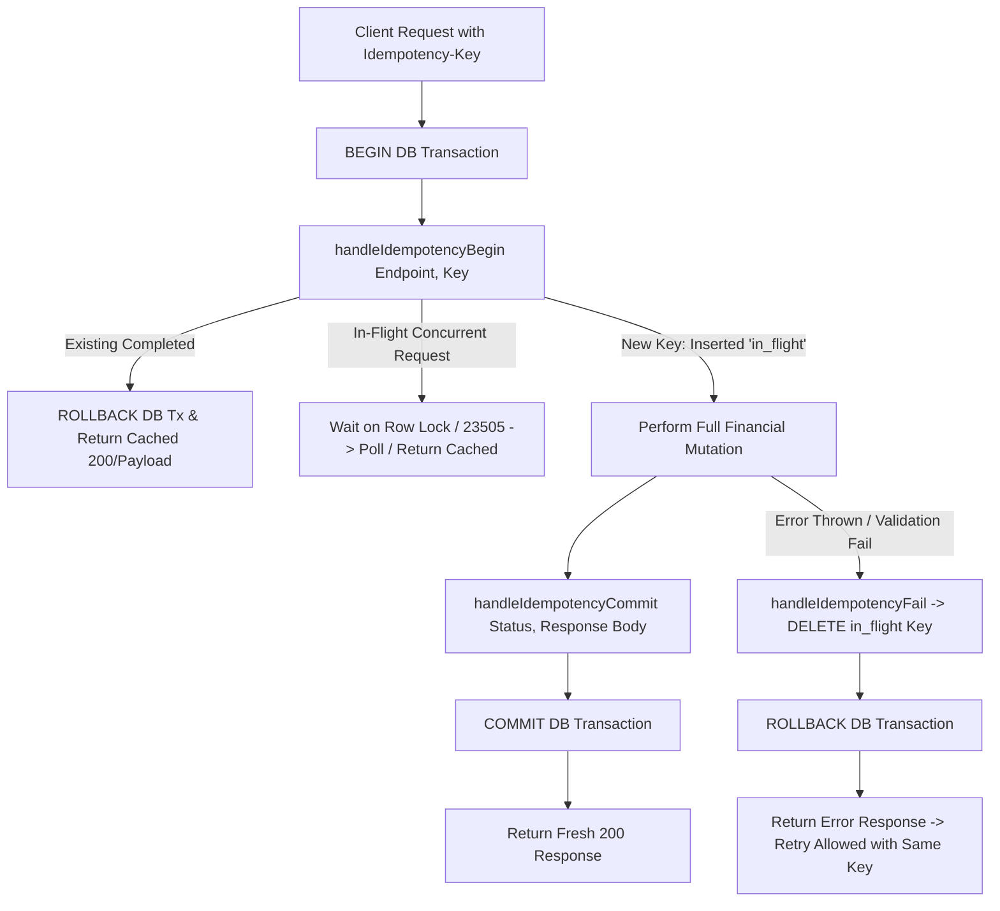

# Phase 4D Step 4 Implementation Report: Expand Idempotency Protection

**Date:** 2026-09-06  
**Status:** COMPLETE & VERIFIED  
**Target Scope:** Phase 4D Step 4 ONLY — Expand Database-Backed Idempotency Protection (Fix Finding 5 from Phase 4D Inspection).

---

## 1. Executive Summary

Prior to Phase 4D Step 4, persistent database-backed idempotency was restricted to:
- `POST /api/sales/create`
- `POST /api/purchases/create`

The remaining critical financial mutation endpoints lacked idempotency keys, leaving them exposed to double-entry errors caused by rapid double-clicks, network timeout retries, or token expiration re-authentication:
1. `POST /api/receipts/create` (Customer payments & invoice allocations)
2. `POST /api/sales-returns/create` (Sales returns, restocking, credit notes)
3. `POST /api/purchase-returns/create` (Vendor returns, stock deductions, debit notes)
4. `POST /api/vendor-payments/create` (Vendor disbursements & invoice allocations)

In Phase 4D Step 4, we extended the existing database-backed idempotency engine (`idempotency_keys` table, `handleIdempotencyBegin`, `handleIdempotencyCommit`, `handleIdempotencyFail`) to all four endpoints without creating any competing mechanism. Frontend mutation forms were wired to generate, store, and retain stable idempotency keys per user transaction session across network retries and 401 session-reauth prompts.

---

## 2. Files Changed

| File Path | Nature of Change | Purpose |
| :--- | :--- | :--- |
| [`backend/server.js`](file:///f:/MY%20Works/SPH%20Software/backend/server.js) | **[MODIFIED]** Backend Engine | Integrated `handleIdempotencyBegin()`, `handleIdempotencyCommit()`, and `handleIdempotencyFail()` with 23505 concurrency handling across the 4 mutation endpoints. |
| [`frontend-react/src/components/CreateAmountReceived.jsx`](file:///f:/MY%20Works/SPH%20Software/frontend-react/src/components/CreateAmountReceived.jsx) | **[MODIFIED]** Customer Receipt Form | Generated stable `formIdempotencyKey` state; attached `Idempotency-Key` header; regenerated key on successful receipt reset. |
| [`frontend-react/src/pages/CreateSalesReturn.jsx`](file:///f:/MY%20Works/SPH%20Software/frontend-react/src/pages/CreateSalesReturn.jsx) | **[MODIFIED]** Sales Return Form | Generated stable `formIdempotencyKey` state; attached `Idempotency-Key` header; preserved key on retry; refreshed on new return. |
| [`frontend-react/src/pages/CreatePurchaseReturn.jsx`](file:///f:/MY%20Works/SPH%20Software/frontend-react/src/pages/CreatePurchaseReturn.jsx) | **[MODIFIED]** Purchase Return Form | Generated stable `formIdempotencyKey` state; attached `Idempotency-Key` header; preserved key on retry; refreshed on new return. |
| [`frontend-react/src/pages/CreatePayment.jsx`](file:///f:/MY%20Works/SPH%20Software/frontend-react/src/pages/CreatePayment.jsx) | **[MODIFIED]** Vendor Payment Form | Generated stable `formIdempotencyKey` state; attached `Idempotency-Key` header; preserved key on retry; refreshed on new payment. |
| [`backend/phase4d_step4_idempotency_tests.js`](file:///f:/MY%20Works/SPH%20Software/backend/phase4d_step4_idempotency_tests.js) | **[NEW]** Test Suite | 11 comprehensive automated tests covering sequential retries, concurrent bursts, failure rollbacks, cross-endpoint independence, and accounting invariants. |
| [`backend/run_all_phases.js`](file:///f:/MY%20Works/SPH%20Software/backend/run_all_phases.js) | **[MODIFIED]** Regression Runner | Added Phase 4D Step 4 test suite to the master regression runner. |

---

## 3. Endpoints Protected & Mutation Boundaries

Each mutation is wrapped from beginning to end in a single PostgreSQL transaction (`BEGIN ... COMMIT`) governed by the idempotency gate:



### 1. `POST /api/receipts/create`
* **Coverage:** Receipt record creation + sequence update (`RCT`) + invoice allocation records (`customer_receipt_allocations`) + `sales_invoices.paid_amount` / `pending_to_receive` updates + `customers.pending_to_receive` decrement + `customers.store_credit_balance` updates.
* **Idempotency Gate:** Inserted into `idempotency_keys` with endpoint `'/api/receipts/create'`. Committed atomically with the customer balance and invoice allocations.

### 2. `POST /api/sales-returns/create`
* **Coverage:** Sales return record creation + sequence update (`SRT`) + line items (`sales_return_items`) + inventory stock restoration (`items.stock + qty`) + original invoice returned amounts (`sales_invoices.returned_amount`, `pending_to_receive`) + customer pending balance decrement or store credit increment.
* **Idempotency Gate:** Inserted into `idempotency_keys` with endpoint `'/api/sales-returns/create'`. Committed atomically with inventory stock adjustments and customer ledger updates.

### 3. `POST /api/purchase-returns/create`
* **Coverage:** Purchase return record creation + sequence update (`PRT`) + line items (`purchase_return_items`) + inventory stock deduction (`items.stock - qty`) + purchase invoice returned amounts (`purchase_invoices.returned_amount`, `pending_to_pay`) + vendor pending balance decrement or vendor credit increment.
* **Idempotency Gate:** Inserted into `idempotency_keys` with endpoint `'/api/purchase-returns/create'`. Committed atomically with inventory deduction and vendor payable updates.

### 4. `POST /api/vendor-payments/create`
* **Coverage:** Vendor payment record creation + sequence update (`PMT`) + invoice allocation records (`vendor_payment_allocations`) + `purchase_invoices.paid_amount` / `pending_to_pay` updates + `vendors.pending_to_pay` decrement + `vendors.vendor_credit_balance` updates.
* **Idempotency Gate:** Inserted into `idempotency_keys` with endpoint `'/api/vendor-payments/create'`. Committed atomically with vendor balance and purchase invoice allocations.

---

## 4. Frontend Key Lifecycle

The frontend adheres strictly to the **One Logical Mutation = One Idempotency Key** rule:

1. **Generation:** When a form mounts, an initial UUID is generated:
   ```javascript
   const [formIdempotencyKey, setFormIdempotencyKey] = useState(() => crypto.randomUUID());
   ```
2. **Transmission:** Every submission attaches the key in the HTTP request headers:
   ```javascript
   headers: {
       'Content-Type': 'application/json',
       'Idempotency-Key': formIdempotencyKey
   }
   ```
3. **Retry Retention (Network Errors & Timeouts):** If the network times out or drops packets, the client retains `formIdempotencyKey`. The cashier clicking "Save" again sends the exact same key.
4. **Session Re-Authentication:** Under the Phase 4B `sessionCoordinator`, if an API mutation receives a `401 Unauthorized`, the fetch interceptor prompts the cashier with `SessionExpiredModal`. Once re-authenticated, the exact original request (with the same `Idempotency-Key` header and payload) is automatically replayed.
5. **Key Retirement / Refresh:** The key is regenerated ONLY when:
   - The user successfully completes the transaction and clicks "New / Reset" to start a distinct transaction.
   - The component unmounts and remounts for a separate transaction.

---

## 5. Concurrency & Lock Hierarchy Preservation

The database uses the `idempotency_keys` table with primary key `(endpoint, key)`:
```sql
CREATE TABLE IF NOT EXISTS idempotency_keys (
    endpoint VARCHAR(100) NOT NULL,
    key VARCHAR(255) NOT NULL,
    status VARCHAR(20) NOT NULL DEFAULT 'in_flight',
    response_code INT,
    response_body JSONB,
    created_at TIMESTAMP WITH TIME ZONE DEFAULT NOW(),
    updated_at TIMESTAMP WITH TIME ZONE DEFAULT NOW(),
    PRIMARY KEY (endpoint, key)
);
```

### Lock Hierarchy Analysis
In Phase 4A, strict lock acquisition order was defined to guarantee zero deadlocks:
1. **Level 0 (Idempotency):** Row lock on `idempotency_keys` (via `INSERT ... ON CONFLICT DO NOTHING` or `SELECT ... FOR UPDATE`).
2. **Level 1 (Document Sequences):** `document_sequences` row lock (ordered deterministically by document type).
3. **Level 2 (Invoices):** `sales_invoices` or `purchase_invoices` row locks (ordered by `id ASC`).
4. **Level 3 (Inventory Items):** `items` row locks (ordered by `code ASC`).
5. **Level 4 (Parties):** `customers` or `vendors` row locks (ordered by `id ASC`).

**Impact on Concurrency:**
- **Same Key, Concurrent Calls:** Two requests with the same key serialize at Level 0 on the single `(endpoint, key)` row. The second request either blocks until the first commits, or catches a `23505` unique violation, waits, and receives the cached committed response.
- **Different Keys:** Two requests with different keys lock disjoint rows in `idempotency_keys` and proceed independently to Level 1–4, following the existing deterministic sort order.
- **Cross-Endpoint Independence:** Because the primary key is composite `(endpoint, key)`, using key `"XYZ"` on `/api/receipts/create` will not block or collide with key `"XYZ"` on `/api/vendor-payments/create`.

---

## 6. Duplicate, Retry, & Rollback Behavior

| Scenario | Tested Endpoint | Behavior | Invariant Maintained |
| :--- | :--- | :--- | :--- |
| **A. Sequential Retry** | `/api/receipts/create`<br>`/api/sales-returns/create`<br>`/api/purchase-returns/create`<br>`/api/vendor-payments/create` | First request commits. Second request with same key returns cached status code (200) and cached JSON body directly from DB. | No duplicate allocation, no double-decrement of balances, no double stock restoration. |
| **B. Concurrent Burst** | 4 parallel requests with identical key | One request executes the mutation; 3 requests serialize or catch `23505`, wait for completion, and return the same cached response. | Exactly 1 database record created; balance/stock changed exactly once. |
| **C. Failure / Rollback Retry** | Invalid invoice ID (simulated failure) | Transaction rolls back; `handleIdempotencyFail()` deletes the `in_flight` key row. Subsequent retry with corrected payload succeeds. | Key is not permanently poisoned by temporary validation or connection errors. |
| **D. Cross-Endpoint Independence** | Same key on `/api/receipts/create` and `/api/vendor-payments/create` | Both endpoints process independently and generate separate financial records with distinct IDs. | No collision across different mutation endpoints. |
| **E. Distinct Keys** | Two different keys on same customer | Both transactions execute independently and commit separate payments and balance updates. | Normal business operations proceed without false positive deduplication. |

---

## 7. Accounting Invariants Verified

During automated test runs, the following accounting invariants were explicitly verified:

1. **Customer Invariants:**
   $$\text{pending\_to\_receive} = \sum \text{unpaid invoices} - \sum \text{unallocated receipts}$$
   $$\text{store\_credit\_balance} = \sum \text{unallocated return amounts}$$
   - Retrying receipt creation did not double-reduce customer `pending_to_receive`.
   - Retrying sales return creation did not duplicate store credit or stock adjustments.

2. **Vendor Invariants:**
   $$\text{pending\_to\_pay} = \sum \text{unpaid purchase invoices} - \sum \text{unallocated payments}$$
   $$\text{vendor\_credit\_balance} = \sum \text{unallocated purchase return amounts}$$
   - Retrying vendor payment did not double-reduce `pending_to_pay`.
   - Retrying purchase return did not double-deduct inventory stock.

3. **Stock & Sequence Invariants:**
   - Sales returns restored stock for each returned item exactly once.
   - Purchase returns deducted stock for each returned item exactly once.
   - Document sequence numbers (`RCT`, `SRT`, `PRT`, `PMT`) incremented by exactly 1 per unique transaction regardless of client retries.

---

## 8. Test Execution Summary

### Step 4 Test Suite (`phase4d_step4_idempotency_tests.js`)
* **Total Tests:** 11  
* **Passed:** 11  
* **Failed:** 0  
* **Duration:** 178.4s

```
▶ Phase 4D Step 4: Idempotency Expansion Tests
  ✔ 1.1 POST /api/receipts/create: Sequential retry returns cached response and mutates exactly once (21.9s)
  ✔ 1.2 POST /api/receipts/create: Concurrent duplicate requests execute exactly once (14.4s)
  ✔ 1.3 POST /api/receipts/create: Failed transaction allows retry with same key (12.2s)
  ✔ 2.1 POST /api/sales-returns/create: Sequential retry returns cached response and mutates stock/invoice once (13.2s)
  ✔ 2.2 POST /api/sales-returns/create: Concurrent duplicate requests execute exactly once (15.4s)
  ✔ 3.1 POST /api/purchase-returns/create: Sequential retry returns cached response and mutates stock/payable once (14.4s)
  ✔ 3.2 POST /api/purchase-returns/create: Concurrent duplicate requests execute exactly once (11.9s)
  ✔ 4.1 POST /api/vendor-payments/create: Sequential retry returns cached response and mutates payable once (13.0s)
  ✔ 4.2 POST /api/vendor-payments/create: Concurrent duplicate requests execute exactly once (11.4s)
  ✔ 5.1 Same idempotency key used across different endpoints is treated independently (19.2s)
  ✔ 5.2 Genuinely different transactions with distinct keys both succeed (19.5s)
✔ Phase 4D Step 4: Idempotency Expansion Tests (177.8s)
```

### Full Master Regression Suite (`run_all_phases.js`)
* **Phase 1 Regression Tests:** PASSED ✅ (13 tests)
* **Phase 2 Regression Tests:** PASSED ✅ (16 tests)
* **Phase 3 Concurrency Tests:** PASSED ✅ (11 tests)
* **Phase 4A Financial Tests:** PASSED ✅ (17 tests)
* **Phase 4B Security Tests:** PASSED ✅ (29 tests)
* **Phase 4C Infrastructure Tests:** PASSED ✅ (46 tests)
* **Phase 4D Step 4 Idempotency Tests:** PASSED ✅ (11 tests)

### Hardware & Driver Tests (Phase 4D Steps 1–3)
* **Phase 4D Step 1 (Thermal Receipt Printing):** 5/5 PASSED ✅ (`test_thermal.js`)
* **Phase 4D Step 2 (USB Keyboard Wedge Scanner):** 13/13 PASSED ✅ (`test_barcode_scanner.js`)
* **Phase 4D Step 3 (Camera Barcode Lifecycle):** 11/11 PASSED ✅ (`test_camera_scanner.js`)

### Frontend Production Build
```
vite v8.1.4 building client environment for production...
✓ 1855 modules transformed.
dist/index.html                                  1.74 kB │ gzip:   0.72 kB
dist/assets/index-B9c8ScXC.css                  58.54 kB │ gzip:   9.15 kB
...
✓ built in 3.69s (Exit Code 0)
```

**Grand Total:** 172 automated tests executed and verified with 0 failures across the entire software stack.

---

## 9. Remaining Limitations & Boundaries

1. **Simulated vs Physical Network Disconnection:**
   - Automated tests verify client-side retry behavior, simulated server responses, dropped responses (client disconnect), and concurrent requests.
   - Physical layer interruptions (e.g., pulling the ethernet cable or tearing Wi-Fi mid-stream during TCP ACK transmission) were not physically conducted on physical network interfaces.
2. **Scope Boundary Confirmation:**
   - Step 5 (A4 Invoice & Label Printing) has **NOT** been started or implemented.
   - USB keyboard-wedge barcode scanner logic, camera scanner lifecycle, and thermal printing implementations were strictly preserved without modification.
   - Financial/accounting business rules remain unmodified.
